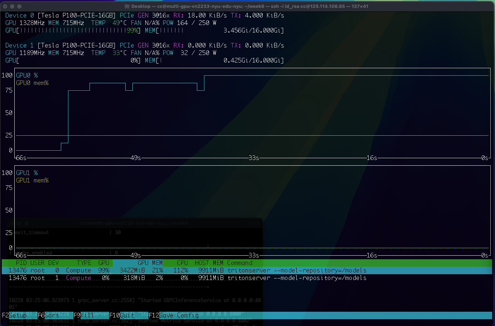
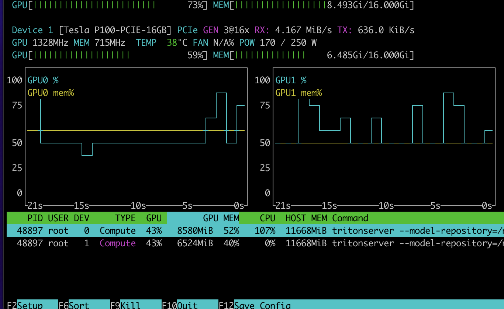

## Model Serving - Image captioning with BLIP

Run the 	`create_server.ipynb` on the Chameleon interface to start your instance and install all dependencies for the experiment.

The p100 node doesn't allow you to install python packages systemwide so we do it in a virtualenv.
```
sudo apt-get install python3-pip python-venv
python3 -m venv .venv
source .venv/bin/activate
pip install torch torchvision transformers onnx onnxruntime-gpu requests
pip install tritonclient[all] tritonserver
```

We will generate an onnx model from the pre-trained BLIP model that will be deployed on Trition. 
```
python3 generate_onnx.py
```

### Setting up Trition model repository

We will create a basic model repository structure that will host multiple models. Here's an example to create a model that runs inference on a single CPU. The respository already contains the model_repository strcuture created, so you can skip the next couple of steps. 
```
model_repository  
├── base_model_cpu  
├────── 1/  
├───────── dummy # will be replaced by model.onnx 
├────── config.pbtxt
```
Create the directory structure  and copy `model.onnx` to base_model config

```
mkdir -p  model_repository/base_model_cpu/1
cp model.onnx ./model_respository/base_model/1
```
Replace the contents of config.pbtxt with the following

```
name: "base_model_cpu"
platform: "onnxruntime_onnx"
max_batch_size: 8    # Batches 8 inferences requests into one for inference at max

input [
  {
    name: "pixel_values"
    data_type: TYPE_FP32
    dims: [ 3, 384, 384 ]
  },
  {
    name: "input_ids"
    data_type: TYPE_INT64
    dims: [ -1 ]
  },
  {
    name: "attention_mask"
    data_type: TYPE_INT64
    dims: [ -1 ]
  }
]

output [
  {
    name: "logits"
    data_type: TYPE_FP32
    dims: [ -1, 30524 ]
  }
]

instance_group [
  {
    kind: KIND_CPU
  }
]

dynamic_batching { 
	preferred_batch_size: [ 1, 2, 4, 8 ] 
	max_queue_delay_microseconds: 1000 
}
```

### Start the triton server


```
docker run --gpus all --rm -p 8000:8000 -p 8001:8001 -p 8002:8002 -v ${PWD}/model_repository:/models nvcr.io/nvidia/tritonserver:24.10-py3 tritonserver --model-repository=/models
```
**Note:** The create server notebook installs `tritonserver:24.10` on the machine. If you are using another verson of the triton server you will have to replace the command with the appropriate version

If successful you will see a log that says

```
"successfully loaded 'base_model_cpu'"
```

Your triton server will run at `localhost:8000`, to send a single inference request to the triton server run:

```
python3 iterative_inference_onnx.py
```

## Performance analyzer comparisions 

We will now run a performance analyser to sent concurrent requests to our server and will measure the latency and throughput. 
**Note:** Make sure to copy the `model.onnx` onto every model similar to that of the cpu step before you run the analyis. If any changes are made to the configs the triton server needs to be restarted for it to reflect


### CPU

```
perf_analyzer -m base_model_cpu --concurrency-range 1:4:1 --shape pixel_values:3,384,384 --shape input_ids:16 --shape attention_mask:16
```
This commands runs tests on the server by sending 1 to 4 concurrent requests in the increments of 1. You will see an output like: 

```
Concurrency: 1, throughput: 10.2532 infer/sec, latency 92589 usec
Concurrency: 2, throughput: 20.5319 infer/sec, latency 92205 usec 
Concurrency: 3, throughput: 24.2073 infer/sec, latency 119359 usec 
Concurrency: 4, throughput: 24.3294 infer/sec, latency 160817 usec
```

### Dynamic batching - Single GPU

All inference requests are batched into groups of either [2, 4, 8] before they are served. 

```
perf_analyzer -m base_model_gpu --concurrency-range 1:8:1 --shape pixel_values:3,384,384 --shape input_ids:16 --shape attention_mask:16
```

Monitor the GPU usage by running `nvtop`



```
Inferences/Second vs. Client Average Batch Latency
Concurrency: 1, throughput: 10.602 infer/sec, latency 90550 usec
Concurrency: 2, throughput: 12.18 infer/sec, latency 159764 usec
Concurrency: 3, throughput: 12.8761 infer/sec, latency 229387 usec
Concurrency: 4, throughput: 14.0988 infer/sec, latency 277634 usec
Concurrency: 5, throughput: 14.3746 infer/sec, latency 345963 usec
Concurrency: 6, throughput: 13.4356 infer/sec, latency 440196 usec
Concurrency: 7, throughput: 14.097 infer/sec, latency 488246 usec
Concurrency: 8, throughput: 15.0306 infer/sec, latency 530322 usec
```


### Concurrent Execution - Multi GPU

Requests are processed parallelly on 2 GPUs 

```
perf_analyzer -m base_model_multi_gpu --concurrency-range 1:10:1 --shape pixel_values:3,384,384 --shape input_ids:16 --shape attention_mask:16
```



```
Inferences/Second vs. Client Average Batch Latency
Concurrency: 1, throughput: 10.6052 infer/sec, latency 89924 usec
Concurrency: 2, throughput: 21.456 infer/sec, latency 88377 usec
Concurrency: 3, throughput: 22.6232 infer/sec, latency 128569 usec
Concurrency: 4, throughput: 25.0411 infer/sec, latency 156797 usec
Concurrency: 5, throughput: 26.9275 infer/sec, latency 181873 usec
Concurrency: 6, throughput: 27.4323 infer/sec, latency 215863 usec
Concurrency: 7, throughput: 28.0197 infer/sec, latency 244219 usec
Concurrency: 8, throughput: 27.3866 infer/sec, latency 286905 usec
Concurrency: 9, throughput: 28.407 infer/sec, latency 312880 usec
Concurrency: 10, throughput: 28.3437 infer/sec, latency 344619 usec
```


#### TensorRT
```
perf_analyzer -m trt_model --concurrency-range 1:4:1 --shape pixel_values:3,384,384 --shape input_ids:16 --shape attention_mask:16
```

**Note:** More models will be added to the model_repository - quantization, distillation, warm vs cold start. And different configurations for batching

